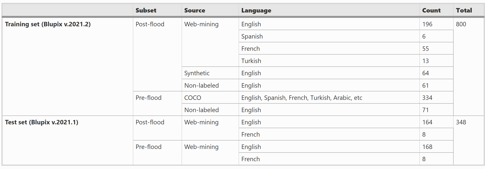

# Blupix Dataset

## Overview:

| Dataset  | Description | Google Drive Link | Used in paper(s) |
| ------------- | ------------- | ------------- | ------------- |
| Blupix train v.2021.2  | Contains 800 annotated photos of stop signs for training the object detection model | [Link](https://drive.google.com/drive/folders/1uZK6xXB4W9QYDx8xgNpi7NqQZkEO1Nxq?usp=sharing) | [^1] [^2] [^3] |
| Blupix test v.2020.1  | Contains 186 annotated paired photos of stop signs (before and after a flood) for testing the object detection model | [Link](https://drive.google.com/drive/folders/1-8d8Qw6T9xvr3Dfas_rdl5gEMubMjyJG?usp=sharing) | [^4] [^8]|
| Blupix test v.2021.1  | Contains 225 annotated paired photos of stop signs (before and after a flood) for testing the object detection model| [Link](https://drive.google.com/drive/folders/1-iyFkGHDXdCzmr774k1okC-ZxlrmvKXp?usp=sharing) | [^3] [^6] [^7] |
| Blupix test v.2022.1  | Contains 300 annotated paired photos of stop signs (before and after a flood) for testing the object detection model | [Link](https://drive.google.com/drive/folders/1uZK6xXB4W9QYDx8xgNpi7NqQZkEO1Nxq?usp=sharing) | [^5] |

## Blupix Dataset Spreadsheet: 
(TBD)[https://drive.google.com/drive/folders/1gPV34yTk2fJOT-111OXHjdch90WN-gaC?usp=sharing]

## Blupix trainining set details
### Blupix train v.2021.2

## Blupix test set
The dataset is designed for testing the trained model and comprises paired photos of stop signs captured before and after a flood event. It encompasses various information, including the photo name (photo ID), country, state, and city (the location of the stop sign in the photo), longitude and latitude (precise coordinates of the stop sign), source (where the photo was sourced from), date taken (when the photo was captured), date saved (when the photo was added to the dataset), flood name (if known), searching keywords (keywords used to find the photos), post-flood link (link to post-flood photos), Google Street View link (link to pre-flood photo on Google Street View), comment (any additional remarks about the photo), and found by (name of the study personnel who discovered the photo). The last three columns in the dataset indicate the presence of the photo in the three different versions of the dataset.

### Blupix test set versions
- Blupix test v.2020.1
Contains 186 paired photos of stop signs
- Blupix test v.2021.1
Contains 224 paired photos of stop signs
- Blupix test v.2022.1
Contains 287 paired photos of stop signs

Note: The photos in the Blupix dataset are not mutually exclusive, rather they have been cumulated in each version of the dataset. Meaning that, Blupix test v.2021.1 contains all photos in the Blupix test v.2020.1 plus 38 additional photos (186 + 38 = 224). Also, Blupix test v.2022.1 contains all photos in the Blupix test v.2020.1 (and Blupix test v.2021.1) plus 63 additional photos (224 + 63 = 287). 

### Annotations
Bounding boxes and masks are two commonly used techniques for annotating images in computer vision tasks. A bounding box is a rectangular box that surrounds an object or region of interest within an image. It is represented by four coordinates: (<object-class> <x_center> <y_center> <width> <height>), which define the top-left and bottom-right corners of the box, however, it does not capture the fine-grained details and shapes of objects within the region of interest. On the other hand, masks provide pixel-level annotations by labeling each pixel within the region of interest. Masks provide detailed and precise information about the shape, boundaries, and contours of objects, making them suitable for tasks such as image segmentation, instance segmentation, and image-to-image translation. In this dataset, we provide mask annotations 

In the given dataset, mask annotations were provided to offer fine-grained masks for future research. This allows researchers to explore more advanced techniques that rely on pixel-level information and fine-grained segmentation. However, to train a YOLO (You Only Look Once) model, the masks were converted to bounding boxes (using [Roboflow software](https://app.roboflow.com/). This conversion from masks to bounding boxes is a common preprocessing step when using YOLO, as YOLO is primarily designed to work with bounding box annotations. While this approach may not capture the fine-grained details of the original masks, it enables faster and more efficient training and inference for object detection tasks.

For the ground truth labels, the object-class 0 refers to a pole and the object-class 1 refers to a stop sign. For the detected labels, the object-class 1 refers to a pole and the object-class 0 refers to a stop sign. As mentioned earlier, the format of labels is as follow:
<object-class> <x_center> <y_center> <width> <height>

## Credits:

The Blupix datasets consist of photos and metadata gathered through a collaborative effort involving study personnel, including Dr. Bahareh Alizadeh (Ph.D. graduate from Texas A&M University), and Nathan Young (Ph.D. student of Texas A&M University), as well as contributions from the general public through crowdsourcing.

## Published papers (APA format):

[^1]: Alizadeh, B., & Behzadan, A. H. (2023). Scalable flood inundation mapping using deep convolutional networks and traffic signage. Computational Urban Science, 3(1), 17.                         https://doi.org/10.1007/s43762-023-00090-1 

[^2]: Hillin, Julia, Alizadeh Kharazi, Bahareh; Li, Diya; Thompson, Courtney; Meyer, Michelle; Zhang, Zhe; & Behzadan, Amir H. (In Press), Designing user-centered decision support systems for climate disasters: What information do communities and rescue responders need during floods? Journal of Emergency Management. (Accepted 9/7/2022).

[^3]: Alizadeh, Bahareh; Li, Diya; Hillin, Julia; Meyer, Michelle; Thompson, Courtney; Zhang, Zhe; Behzadan Amir H. (2022), Human-Centered Flood Mapping and Intelligent Routing through Augmenting Flood Gauge Data with Crowdsourced Street Photos, Advanced Engineering Informatics, 54, 101730. https://doi.org/10.1016/j.aei.2022.101730. 

[^4]: Alizadeh, Bahareh; & Behzadan, Amir H. (2021), Flood depth mapping in street photos with image processing and deep neural networks. Computers, Environment and Urban Systems, 88, 101628. https://doi.org/10.1016/j.compenvurbsys.2021.101628 

[^5]: Alizadeh Kharazi, Bahareh; & Behzadan, Amir H. (2023), Mapping of 2021–2022 floods in North America from street photos with artificial intelligence, Proceedings of the Institution of Civil Engineers–Smart Infrastructure and Construction, https://doi.org/10.1680/jsmic.22.00029

[^6]: Alizadeh, Bahareh; & Behzadan, Amir H. (2022), Blupix: Citizen science for flood depth estimation in urban roads. The 5th ACM SIGSPATIAL Workshop on Advances on Resilient and Intelligent Cities, Seattle, WA. https://doi.org/10.1145/3557916.3567824 

[^7]: Alizadeh, Bahareh; & Behzadan, Amir H. (2022), Crowdsource-based Deep Convolutional Networks for Urban Flood Depth Mapping. 2022 European Conference on Computing in Construction, Rhodes, Greece. https://doi.org/10.48550/arXiv.2209.09200  

[^8]: Alizadeh, Bahareh; Li, Diya; Zhang, Zhe; Behzadan, Amir H. (2021), Feasibility Study of Urban Flood Mapping Using Traffic Signs for Route Optimization. In the proceeding of 28th EG-ICE International Workshop on Intelligent Computing in Engineering. Berlin, Germany. https://arxiv.org/abs/2109.11712  
